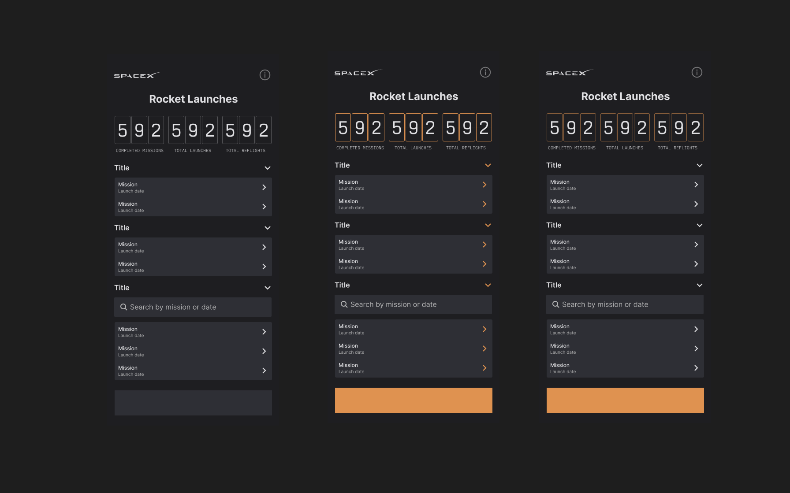
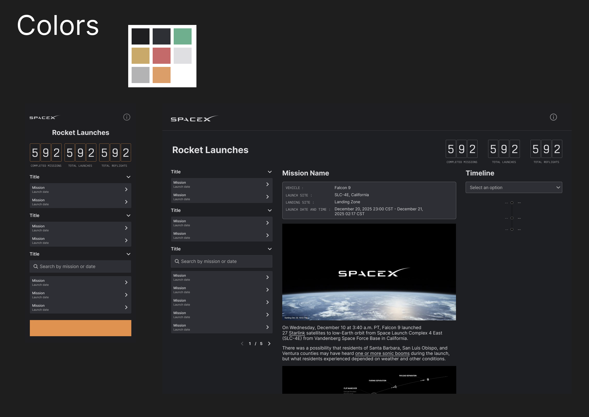

# SpaceX Mission control
A responsive dashboard to explore SpeceX rocke tlaunches. Built with React + Typescript + Tailwind, this project emphasizes modular components, smooth interactions and clear data visualization.

## Table of contents
1. Project overview
2. Live demo
3. Architecture & Tech stack
4. Components & Features
5. Design decisions
6. AI Assistance
7. Challenges & Trade-offs
8. Future enhancements / scalability
9. Deployment
10. Figma Designs

## Project Overview
SpaceX Mission Control is a dashboard to visualize the history of SpaceX rocket launches using the free public SpaceX API.

- Explore past, upcoming and active missions
- Detailed mission information: video, rocket, launchpad, landing site
- Searchable and sortables `Past` missions
- Fully responsive, with mobile and desktop layouts

## Architecture & Tech stack
### Folder structure
/src
    /components - Reusable UI components: Button, Accordion,EmptyState, etc.
    /containers - Orchestrator components: LaunchBrowser, LaunchDetails, MainBody
    /hooks - Custom hooks: useBreakpoint
    /constants 
    /utils - Helpers: date formating, API fetching
    /types - Typescript interface

### Tools

- React 18 with **strict TypeScript mode**
- Vite as a fast bundler and dev server
- Tailwind CSS fully configured with PostCSS and Autoprefixer
- Framer Motion for smooth transitions

### State & Data management
- Load component state(`useState`,`useEffect`) basic for this project
- Future **scalability**: could use Zustand or Redux for global state

## Component & Features

### UI components
 - Button
 - Accordion
 - Count & CountContainer
 - EmptyState
 - Search
 - RetryButton
 - Notification

### Orchestrator components
- MissionList & MissionSearchableList
- LaunchBrowser
- LaunchDetails

### Hooks
- useBreakpoint

### Features
- Loading, error and empty states
- Responsive design for mobile and desktop
- Searchable past launches with live filtering
- Modular, reusable components

## Design decision
- Layout: Sidebar + main panel inspired by modern dashboards
- Detail View: 
    - On mobile, it slides-in
    - On desktop it's always visible
- UX considerations
    - Sorted missions for better browsing: upcaoming ascending, past descending
    - Clear empty state messages with actionable UI (e.g. `clear Search`)

## AI Assistence
During the creation of this project, I used **ChatGPT** as a collaborative teammate, to boost efficiency and brainstorming, both for coding and design exploration.

Here are some registered notes of my process:
- **Dec 17-18:** Discussed initial concepts for the data to display and explore different UX ideas for the layout. ChatGPT helped validate whether my layout decisions made sense from the user perspective.
- **Dec 19:** After creating wireframes in Figma, I asked ChatGPT to propose color palettes. This accelerated my color exploration process, which usually takes longer than wireframing.
- **Dec 21:** While building the `Search` component, I ran into a trade-off regarding clearing typed values when the user clicked `Clear`. I used ChatGPT to brainstorm solutions.
- **Dec 22:** Decided how to fetch mission metadata efficiently using `Promise.all` for multiple API calls. ChatGPT helped me reason through pitfalls, such as avoiding new object creation on each render, which was causing re-render loops.
- **Dec 23** RetryButton & error recovery system. Used ChatGPT to refine a retry mechanism that renders only when the initial API request fails. The button re-triggers the fetch and enforces a per-session retry limit using `sessionStorage` to prevent excessive API calls.
- **Dec 24** AnimatedCount Component. While finishing the UI and functionality. I wanted to add a final touch to the numeric counters.
I described the grouped-digit structure and the desired behavior (counting from 0 to the final value) to get guidance on the most appropriate animation approach.

All AI-generated suggestions were carefully reviewed and adapted to maintain consistency, readability, and project standards.

## Challenges & trade-offs
- **API limitations:**
    - `Active missions` endpoint not available; left placeholder for future enhancement
    - Limited historical data (most recent year: 2022)
- **Debounced search:** 
    - Built a custom debounce utility, didn't rely on external libraries for simplicity
- **Responsive layouts:** 
    - Tailwind doesn't support `grid-template-areas`.
    - Layout variations across breakpoints were handled via a custom `useBreakpoint` hook.

### Trade-offs
- Local state was sufficient; no global state management implemented yet

## Future enhancements / Scalability
- Introduce global state management for larger datasets
- Implement timeline component to visualize launches chronologically
- Add a theme toggle (dark/light)
- Add unit testing using Jest
- Implement scrollTop() for long contet
- Add Pagination to long mission lists

## Deployment
(Planned after final desktop + mobile completition)

## Figma Design

**Wireframes**  

**Color Tests**  
**Mobile:**  
  

**Desktop:**  
